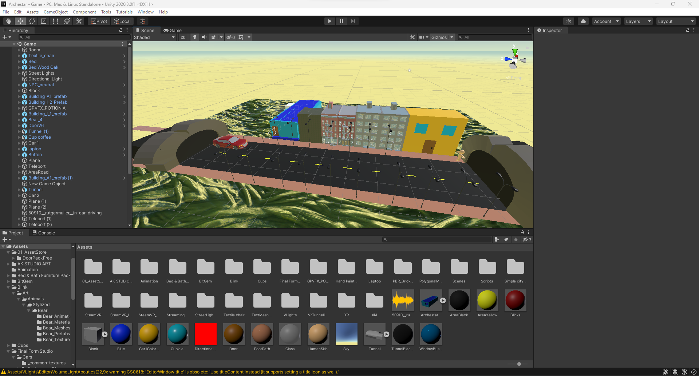
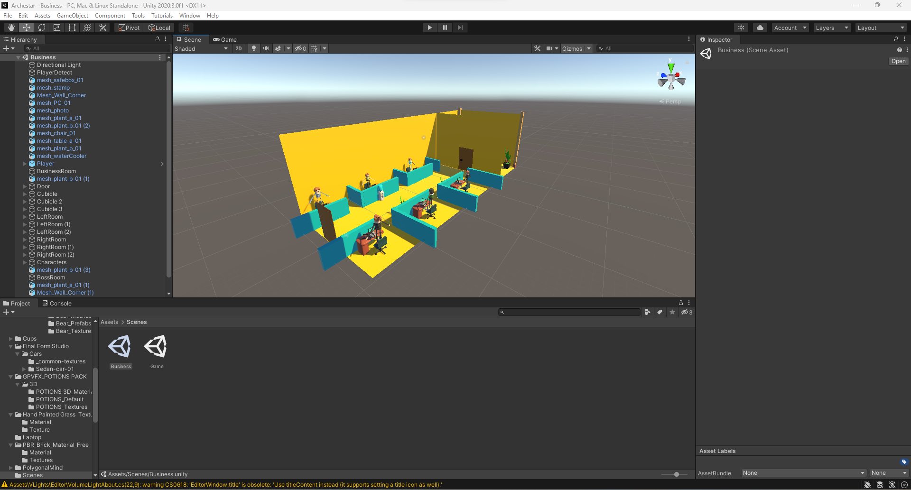

# Archestar (Unity VR game)

### Screenshots:

### Requirements:

Unity 2020.3.0f1 (required)

SteamVR (optional test & requires Steam account)

Blender 3+ (required)

Note: I cleaned my game using [Unity Sweeper](https://github.com/NotionTheory/unity-sweeper).

If anyone wanted to get backup unused assets, here is a part one [download link](https://mega.nz/file/vhtXRbZA#BNubaTYUKduKbNVjCvymqc2rzg5tTdYtYxZ-N-5xgqk).

Unused backup assets part two is a [download link](https://mega.nz/file/XhFDURAZ#noNqRwdQuDj2zRt3JkC84Z2a9EHV9pWSf6Mw6eEPzyc).

### Explanation video:

YouTube: https://www.youtube.com/watch?v=BSULsZ8uyew

Piped: https://piped.video/watch?v=BSULsZ8uyew

Invidious: https://invidio.us/watch?v=BSULsZ8uyew

- Martin Eesmaa